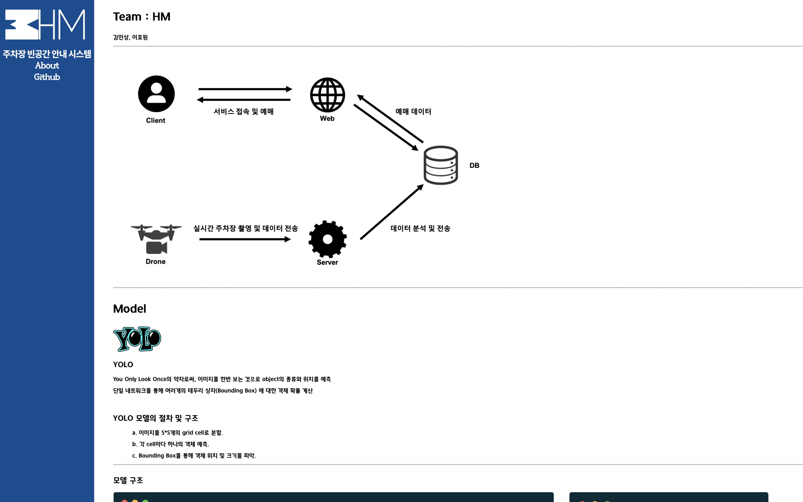

# H&M
## 한양대학교 ERICA 캡스톤디자인 
> Start 2021.03.02

  

## About
- 주차장 빈공간 예측모델을 바탕으로 웹기반 주차장 빈공간 안내 서비스 제공
- Yolo V3, Yolo-Mark, Php, KakaoMap API, Javascript
## Members

     

    김민상 이효원

## Work
---
2021.03.25
- git에 그동안 했었던 파일 업로드
---
2021.03.26
- UI 작업중
---
2021.04.21
- 모델 검증 및 시각화용 작은 주차장 모델 제작예정 
---
2021.05.01
- 웹 레이아웃 구상
---
2021.05.04
- 작은 주차장모델 제작비 신청
- 레이아웃 및 DB 연동
---
2021.05.14
- 레이아웃 기본 완성
---
2021.05.22
- 기능 구현
    1. 원의 반경에 따른 마커 이미지 변경
    	- 여유 : green
    	- 부족 : red
    	- 원의 반경 외부 : gray
    2. 원의 반경안에 있는 마커들의 정보 표시
    3. 마커 click시 길찾기 화면으로 이동
---
2021.05.27
- 기능 구현
    1. 카드 클릭시 이미지 팝업
    2. 원의 반경 수치 표시

---
